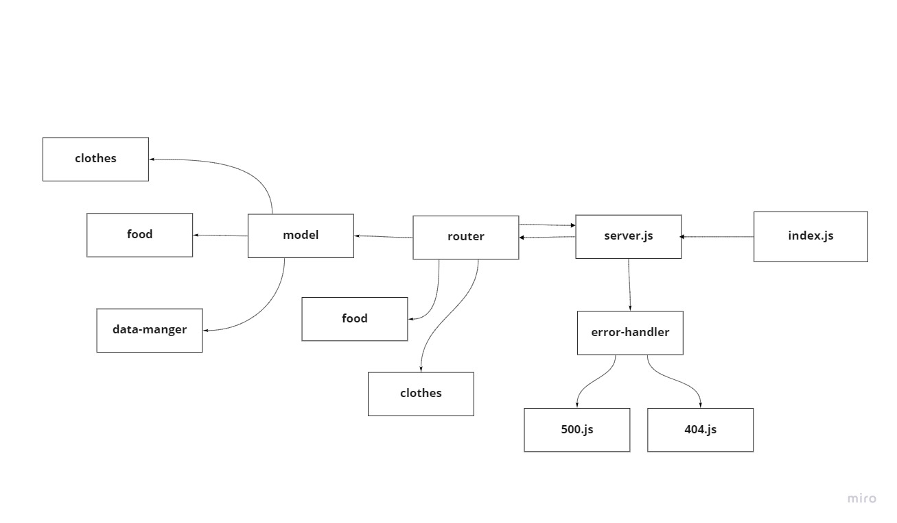

# Sql-api-server

## Test CI:
[URL]()

## Heroku Link:
[URL]()

## Pull Request:
[URL](https://github.com/AyahZaareer/sql-api-server/pull/1)

## Setup:
1.clone the repo.
2.npm init -y.
3.npm exprees,dotenv,supertest,mongooes,cors,supuergooes,route,uuid.

### Endpoint:
- (/api/vi/food):
  - GET to read data
  -  POST to creat data

- (/api/vi/food/:id)
  - PUT to updat data by ID
  -  DELETE to delete data by ID 
  - GET to read data by ID

## Test:
.Unit test: npm test

